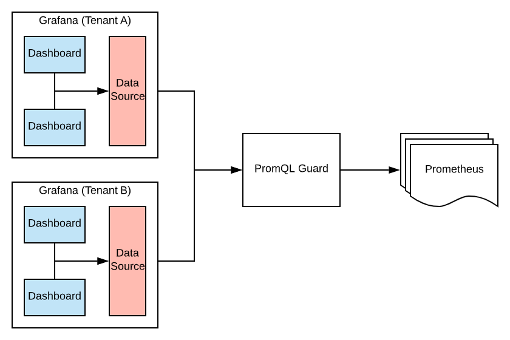

# PromQL Guard

PromQL Guard provides a thin proxy on top of Prometheus, that allows us to inspect and re-write promql queries, so that a tenant can only see the data we allow, even when using a shared Prometheus server.

The original intended use case, is managing multiple Grafana instances for tenants, though there is nothing Grafana specific in the implementation.

## How it works

```yaml
# Example Configuration File
hosts:
  - hostname: tenantA.example.com
    prometheus:
      upstream: https://prometheus.example.com
      matcher: '{service="tenantA"}'
  - hostname: tenantB.example.com
    prometheus:
      upstream: https://prometheus.example.com
      matcher: '{app=~"appY|appZ"}'
```

PromQL Guard proxies the Prometheus API, re-writing the query to restrict to a certain tenant.

Querying `tenantA.example.com` with the query `foo - bar` would be re-written to `foo{service="tenantA"} - bar{service="tenantA"}` before being proxied to `https://prometheus.example.com`

Querying `tenantB.example.com` with the query `secret{app="appX}` would be re-written to `secret{app="appX", app=~"appY|appZ"}` before being proxied to `https://prometheus.example.com` which would result in no metrics being returned.


## Faq

### Isn't Host header very easy to override?

PromQL Guard is not designed to protect malicious actors (for that scenario, fully separated environments is best). By using the `Host` header, it provides a simple way to have a single proxy used for multiple tenants. When using a shared Grafana instance, each tenant could be assigned their own organization, with users granted `Editor` role. The Grafana admin can then setup a datasource for each tenant so they can only see the metrics they have permission for.

### What if the user directly queries the upstream Prometheus?

Direct access to the upstream Prometheus servers should be controled by other access means such as network access control or firewall. The Grafana `Admin` can register promql-guard as a Prometheus datasource and then be reasonably sure that tenants with `Viewers` and `Editors` roles can freely edit dashboards and query metrics without viewing other tenants data.


